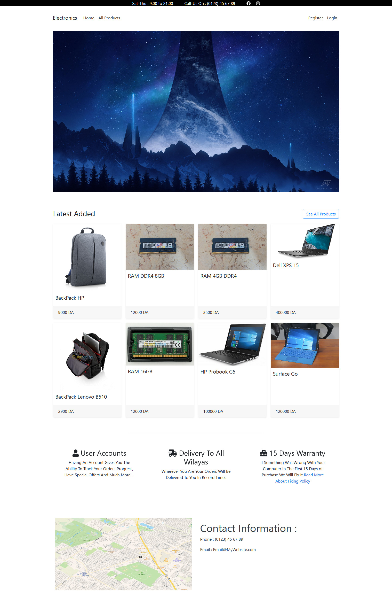
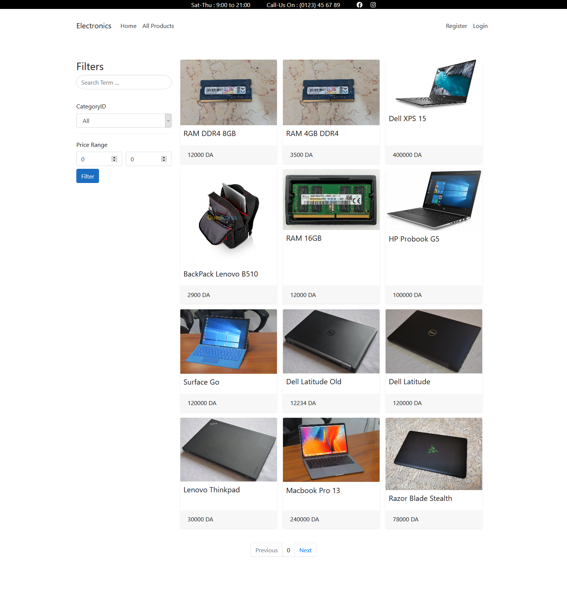
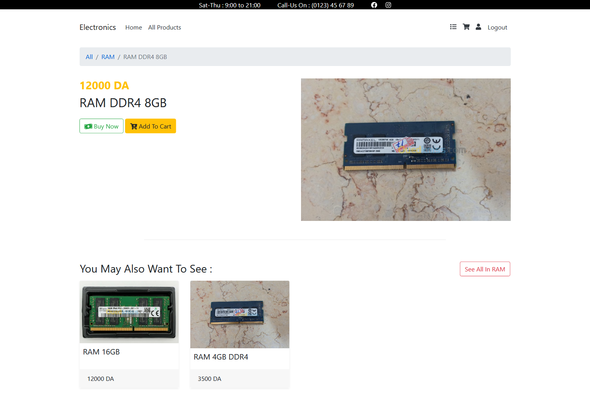
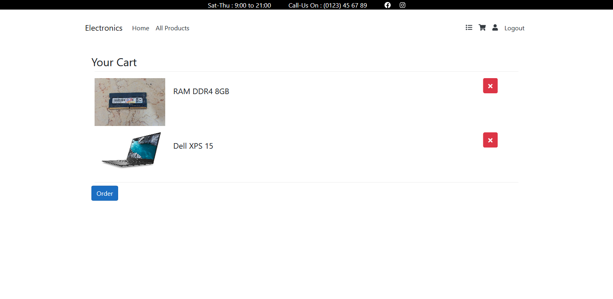
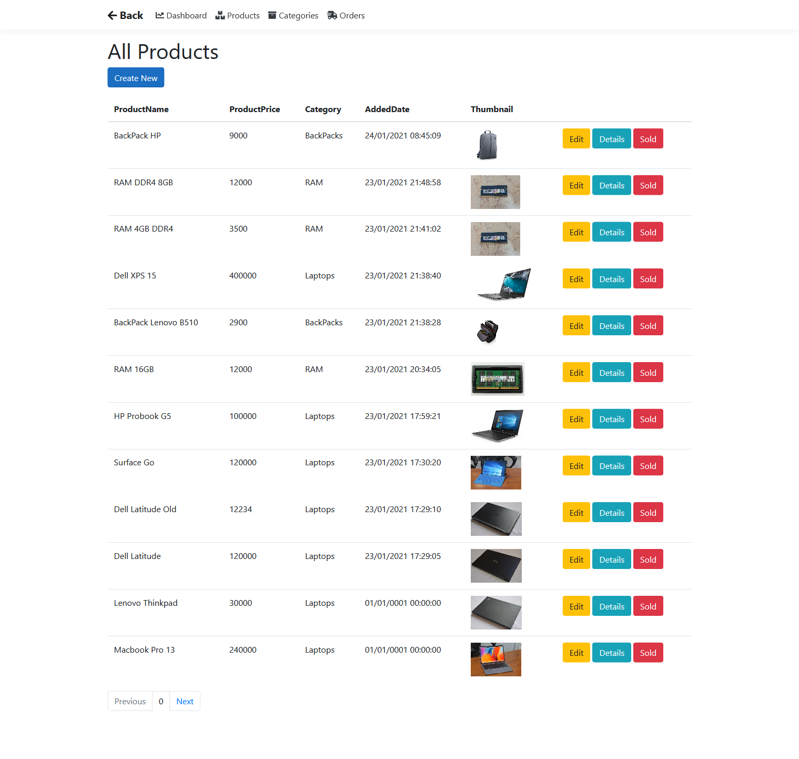

# Basic E-Commerce Website Using .NET 5 And Raozor Pages

### What Can The Web App Do

- Basic Home Page

- Can Authenticate Users And Has Basic Authorization (Admin And Client)
- Has A List Of All Products With The Necessary Filters And Basic Pagination

- Client Can See Details About Products They Are Interested In

- They Can Add Products To Their Cart

- When They Order They Will Be Sent To A Page Where They Have All Their Orders, The Website/Store Owner Also Sees All The Orders In The Same Way

- Admin Panel :

### What I Learned Creating This Project

- How To Use Entity Framework In A Better Way
- How To Integrate Blazor Components Into Razor Pages
- Filtering, Sorting And Pagination ( Though This One Was A Custom Pagination System )
- Better At Working With Files And Images

